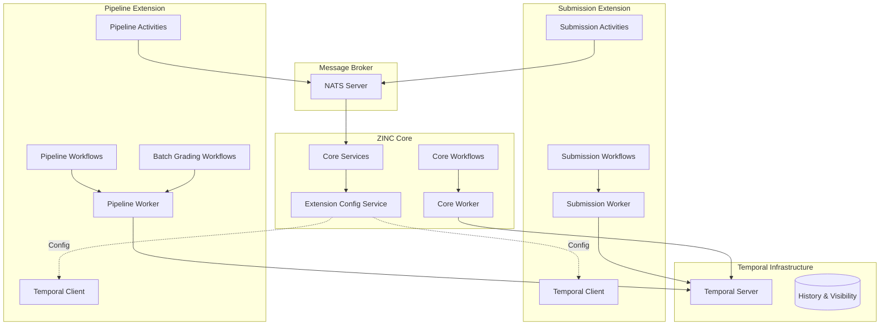
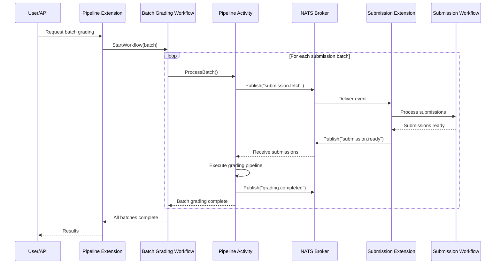

# [RFD] Temporal Workflow Orchestration Integration

## Overview

This Request for Discussion (RFD) proposes the integration of Temporal workflow orchestration into ZINC to enable robust batch processing capabilities and provide workflow management infrastructure for extensions. The integration aims to leverage Temporal's durable execution model to handle complex, long-running workflows such as batch grading of submissions, while maintaining ZINC's modular extension architecture. This proposal builds upon the extension system established in RFD 0009 and provides the workflow orchestration layer necessary for reliable, scalable processing of academic workflows.

## Background

The current ZINC architecture, as enhanced by the extension system (RFD 0009), provides a modular, event-driven platform for academic grading and submission management. However, several limitations exist in handling complex, multi-step workflows:

### Current Limitations

**Lack of Orchestration Capabilities**: While the event-driven architecture enables loose coupling between extensions, there is no built-in mechanism for orchestrating complex, multi-step workflows that may span hours or days. Processing batch submissions requires coordination across multiple services with proper error handling and retry logic.

**State Management Complexity**: Managing the state of long-running processes across distributed extensions is challenging. Without a proper workflow engine, extensions must implement custom state machines, leading to duplicated effort and potential inconsistencies.

**Limited Visibility and Debugging**: When processing fails mid-workflow, understanding the current state and debugging issues is difficult without centralized workflow tracking and history.

**Scalability Constraints**: The current system lacks sophisticated mechanisms for rate limiting, concurrent execution control, and resource management when processing large batches of submissions.

### Why Temporal?

Temporal provides a proven solution for workflow orchestration with the following benefits:

- **Durable Execution**: Workflows maintain state across failures, network partitions, and process restarts
- **Built-in Retry Logic**: Configurable retry policies for activities with exponential backoff
- **Workflow Versioning**: Safe deployment of workflow changes without breaking in-flight executions
- **Observability**: Complete visibility into workflow execution history and current state
- **Language-Native Development**: Workflows are written in Go, maintaining consistency with ZINC's technology stack

The integration of Temporal aligns with ZINC's architectural principles of modularity and separation of concerns, while providing the robustness required for mission-critical academic workflows.

## Proposal

The proposed Temporal integration follows a domain-integrated architecture where workflow definitions and activities reside within their respective domains, both in core and extensions. This approach maintains clear boundaries while providing powerful orchestration capabilities.

### High-Level Architecture

The integration consists of three key architectural decisions:

1. **Domain-Integrated Structure**: Workflows and activities live alongside their domain logic, preventing tight coupling between unrelated workflows while maintaining cohesion within domains.

2. **Extension Ownership**: Extensions have full ownership of their workflows and workers, interacting directly with Temporal while receiving connection configuration from core.

3. **NATS-Based Coordination**: Cross-extension communication occurs through NATS messaging within activities, maintaining the existing event-driven patterns while ensuring workflows remain deterministic.

### Core Components

**Temporal Infrastructure Package** (`internal/temporal/`): A minimal shared package providing:
- Client wrapper with connection management
- Worker lifecycle management with FX integration
- Helper types for workflow and activity registration
- Configuration structures

**Domain Workflows**: Each domain (core and extensions) defines its own workflows:
- Submission processing workflows in submission extension
- Batch grading workflows in pipeline extension

**Configuration Service Enhancement**: The existing extension configuration service is enhanced to provide Temporal connection details to extensions.

## Architecture

### Package Structure

The architecture follows a domain-integrated approach with minimal shared infrastructure:

```
zinc-core/
├── internal/temporal/         # Minimal shared infrastructure
│   ├── client.go              # Client wrapper with connection management
│   ├── worker.go              # Worker with group injection
│   ├── types.go               # AsActivity/AsWorkflow helper functions
│   └── module.go              # FX modules (Module and WorkerModule)
│
├── internal/api/pipeline/     # Extension-specific Temporal integration
│   ├── workflow.go            # Batch grading workflows
│   ├── activities.go          # Batch-specific activities
│   └── module.go              # FX registration for pipeline workflows
│
├── internal/extension/        # Extension configuration service
│   └── service.go             # Enhanced with Temporal config distribution
│
└── internal/pipeline/         # Pipeline domain logic
    └── service.go             # Pipeline processing service
```

### System Architecture Diagram



### Extension Integration Pattern

Extensions interact with Temporal through a well-defined pattern:

1. **Configuration Retrieval**: Extensions request Temporal configuration during initialization
2. **Client Creation**: Each extension creates its own Temporal client using provided configuration
3. **Worker Management**: Extensions manage their own workers with domain-specific task queues
4. **Workflow Registration**: Extensions register their workflows and activities with their workers

### Cross-Extension Communication

Communication between extensions follows the established NATS pattern within activities:



## Configuration Management

The system employs a simple, extensible configuration approach:

### Core Configuration

```yaml
temporal:
  host: temporal.example.com
  port: 7233
  namespace: zinc-dev  # Environment-specific
  task_queue_prefix: zinc
```

### Extension Configuration Distribution

The extension service provides Temporal configuration through the existing configuration mechanism:

```protobuf
message Configuration {
  string name = 1;
  map<string, string> properties = 2;
}

// Extension receives:
// name: "temporal"
// properties: {
//   "host": "temporal.example.com",
//   "port": "7233",
//   "namespace": "zinc-dev",
//   "task_queue": "zinc-submission"  # Extension-specific
// }
```

### Environment Strategy

Namespaces are environment-based to provide clean separation:
- `zinc-dev` for development
- `zinc-staging` for staging
- `zinc-prod` for production

Each extension uses a unique task queue within the namespace:
- `zinc-core-default`
- `zinc-submission-default`
- `zinc-pipeline-default`

## Workflow Patterns

### Batch Processing Pattern

Batch workflows handle large-scale operations with controlled concurrency:

```
BatchGradingWorkflow
├── Validate batch parameters
├── Prepare batch metadata
├── For each submission group (parallel with limits)
│   ├── Execute grading activity
│   ├── Handle failures with retry
│   └── Collect results
├── Aggregate results
└── Generate reports
```

Key considerations:
- Use of `workflow.Go()` for parallel execution
- Selector pattern for result streaming
- Continue-as-new for very large batches
- Proper error aggregation and reporting

### Activity Design Pattern

Activities encapsulate non-deterministic operations and external interactions:

```
GradingActivity
├── Validate input
├── Check authorization
├── Retrieve submission from storage
├── Trigger pipeline via NATS
├── Wait for completion event
├── Store results
└── Return grading outcome
```

Activities receive dependencies through FX injection, maintaining clean separation from workflows.

### Workflow Versioning

The system uses Temporal's native versioning API for handling workflow updates:

```
version := workflow.GetVersion(ctx, "AddRetryLogic", workflow.DefaultVersion, 1)
if version == 1 {
    // New logic with retry
} else {
    // Original logic
}
```

This approach ensures safe updates without breaking in-flight workflows.

## Extension Capabilities

### Full Workflow Ownership

Extensions have complete control over their workflow definitions:

1. **Workflow Definition**: Extensions define workflows specific to their domain
2. **Activity Implementation**: Activities have access to extension-specific dependencies
3. **Worker Configuration**: Extensions control worker options and concurrency
4. **Task Queue Management**: Each extension uses its own task queue

### Workflow Boundaries

Workflows are strictly scoped to their extensions:
- No direct workflow-to-workflow calls across extensions
- Cross-extension interaction only through NATS in activities
- Clear ownership and responsibility boundaries

### Extension Lifecycle

Extensions manage their Temporal lifecycle independently:

```
Extension Startup:
1. Retrieve Temporal config from core
2. Create Temporal client
3. Initialize worker with task queue
4. Register workflows and activities
5. Start worker

Extension Shutdown:
1. Stop accepting new workflows
2. Wait for current executions
3. Shutdown worker gracefully
4. Close client connection
```

## Security Considerations

### Authentication and Authorization

- **mTLS**: Temporal cluster connections use mutual TLS for authentication
- **Namespace Isolation**: Each environment has its own namespace with access controls
- **Activity-Level Authorization**: Activities verify permissions before executing operations

### Data Protection

- **Encryption at Rest**: Temporal database encrypted at rest
- **Sensitive Data Handling**: Avoid storing sensitive data in workflow history
- **Audit Logging**: All workflow executions are logged for audit purposes

### Extension Isolation

- **No Direct Access**: Extensions cannot access other extensions' workflows
- **Configuration Scoping**: Each extension receives only its configuration
- **Task Queue Isolation**: Separate task queues prevent cross-extension interference

## Monitoring and Observability

### Metrics

The integration provides comprehensive metrics:

- **Workflow Metrics**: Start rate, completion rate, failure rate, duration
- **Activity Metrics**: Execution time, retry count, failure reasons
- **Worker Metrics**: Task queue depth, polling success rate, concurrent executions
- **Business Metrics**: Submissions processed, grading throughput, batch sizes

### Tracing

OpenTelemetry integration provides distributed tracing:

```
Trace: Batch Grading Request
├── Span: Start Batch Workflow
├── Span: Validate Batch
├── Span: Process Submission Group
│   ├── Span: Grade Submission Activity
│   ├── Span: NATS Publish
│   └── Span: Store Results
└── Span: Generate Report
```

### Workflow Visibility

Temporal provides built-in visibility features:

- **Workflow Status**: Current state of all workflows
- **Search Capabilities**: Query workflows by various attributes
- **History Replay**: Complete execution history for debugging
- **UI Access**: Temporal Web UI for operational visibility

## Migration Strategy

### Phased Approach

The integration follows a phased migration strategy:

**Phase 1: Core Infrastructure**
- Deploy Temporal infrastructure
- Implement shared Temporal package
- Set up monitoring and observability

**Phase 2: Batch Grading**
- Implement batch grading workflows in pipeline extension
- Migrate existing batch operations to pipeline extension
- Validate performance and reliability

**Phase 3: Extension Integration**
- Update extension configuration service
- Implement Temporal in submission extension
- Implement Temporal in pipeline extension

**Phase 4: Advanced Features**
- Implement complex workflow patterns
- Add workflow scheduling
- Enhance monitoring and alerting

### Backward Compatibility

The migration maintains backward compatibility:

- Existing NATS events continue to function
- Extensions can adopt Temporal incrementally
- Core APIs remain unchanged
- Gradual migration of batch operations

## Discussion

Several aspects require further consideration during implementation:

### Resource Management

**Question**: How should we manage resource limits across extensions?

While starting without limits provides flexibility, production deployments will need:
- Worker pool sizing strategies
- Rate limiting for workflow starts
- Resource quotas per extension
- Backpressure mechanisms

### Workflow Granularity

**Question**: What is the appropriate granularity for workflows?

Considerations include:
- Single submission vs. batch workflows
- Activity size and duration
- State management complexity
- Reusability across domains

### Error Handling Strategy

**Question**: How should different error types be handled?

Error categories requiring different strategies:
- Transient errors (network, temporary unavailability)
- Business logic errors (validation failures)
- System errors (out of memory, disk full)
- External service errors (pipeline failures)

### Operational Procedures

**Question**: What operational procedures are needed?

Key operational concerns:
- Workflow termination policies
- Stuck workflow detection
- Manual intervention procedures
- Disaster recovery plans

### Performance Optimization

**Question**: How do we optimize for performance?

Performance considerations:
- Workflow caching strategies
- Activity batching
- Parallel execution limits
- History size management

## Alternatives Considered

### Alternative Workflow Engines

**Apache Airflow**: Popular for data pipelines but:
- Python-based, inconsistent with Go stack
- More suited for scheduled batch jobs
- Less support for long-running workflows

**Cadence**: Temporal's predecessor but:
- Smaller community
- Less active development
- Migration path to Temporal exists

**Custom Solution**: Build workflow engine in-house but:
- Significant development effort
- Maintenance burden
- Reinventing proven solutions

### Alternative Architectures

**Centralized Workflow Service**: Single service managing all workflows but:
- Creates bottleneck
- Violates extension independence
- Increases coupling

**Workflow-per-Submission**: Individual workflows for each submission but:
- Excessive resource usage
- Difficult batch management
- Complex aggregation

## Conclusion

The integration of Temporal workflow orchestration into ZINC addresses critical gaps in handling complex, long-running academic workflows while maintaining the modular architecture established by the extension system. The domain-integrated approach ensures clear separation of concerns, with extensions maintaining full ownership of their workflows while leveraging shared infrastructure.

Key benefits of this integration include:

- **Reliability**: Durable execution ensures workflows complete despite failures
- **Scalability**: Controlled concurrency and resource management for large-scale processing
- **Visibility**: Complete observability into workflow execution and state
- **Flexibility**: Extensions can evolve their workflows independently
- **Maintainability**: Clear boundaries and patterns reduce complexity

The proposed architecture provides a solid foundation for current requirements while remaining extensible for future needs. The phased migration approach ensures smooth adoption with minimal disruption to existing operations.

## References

1. [Temporal Documentation](https://docs.temporal.io/)
2. [Temporal Go SDK](https://github.com/temporalio/sdk-go)
3. [Workflow Patterns](https://temporal.io/docs/concepts/workflows)
4. [Activity Best Practices](https://temporal.io/docs/concepts/activities)
5. [ZINC RFD 0009: Extension System](../0009/README.md)
6. [Uber FX Dependency Injection](https://uber-go.github.io/fx/)
7. [NATS Messaging](https://nats.io/)
8. [OpenTelemetry Specification](https://opentelemetry.io/docs/)
