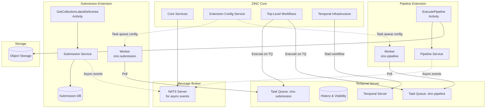
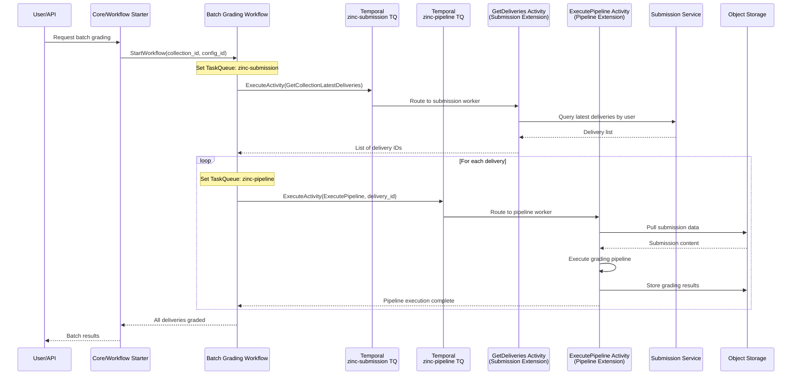

# [RFD] Temporal Workflow Orchestration Integration

## Overview

This Request for Discussion (RFD) proposes the integration of Temporal workflow orchestration into ZINC to enable robust batch processing capabilities and provide workflow management infrastructure for extensions. The integration aims to leverage Temporal's durable execution model to handle complex, long-running workflows such as batch grading of submissions, while maintaining ZINC's modular extension architecture. This proposal builds upon the extension system established in RFD 0009 and provides the workflow orchestration layer necessary for reliable, scalable processing of academic workflows.

## Background

The current ZINC architecture, as enhanced by the extension system (RFD 0009), provides a modular, event-driven platform for academic grading and submission management. However, several limitations exist in handling complex, multi-step workflows:

### Current Limitations

**Lack of Orchestration Capabilities**: While the event-driven architecture enables loose coupling between extensions, there is no built-in mechanism for orchestrating complex, multi-step workflows that may span hours or days. Processing batch submissions requires coordination across multiple services with proper error handling and retry logic.

**State Management Complexity**: Managing the state of long-running processes across distributed extensions is challenging. Without a proper workflow engine, extensions must implement custom state machines, leading to duplicated effort and potential inconsistencies.

**Limited Visibility and Debugging**: When processing fails mid-workflow, understanding the current state and debugging issues is difficult without centralized workflow tracking and history.

**Scalability Constraints**: The current system lacks sophisticated mechanisms for rate limiting, concurrent execution control, and resource management when processing large batches of submissions.

### Why Temporal?

Temporal provides a proven solution for workflow orchestration with the following benefits:

- **Durable Execution**: Workflows maintain state across failures, network partitions, and process restarts
- **Built-in Retry Logic**: Configurable retry policies for activities with exponential backoff
- **Workflow Versioning**: Safe deployment of workflow changes without breaking in-flight executions
- **Observability**: Complete visibility into workflow execution history and current state
- **Language-Native Development**: Workflows are written in Go, maintaining consistency with ZINC's technology stack

The integration of Temporal aligns with ZINC's architectural principles of modularity and separation of concerns, while providing the robustness required for mission-critical academic workflows.

## Proposal

The proposed Temporal integration follows a cross-task-queue architecture where workflows represent high-level orchestration logic at the top level, while activities remain within their respective extensions. This approach leverages Temporal's native capabilities for cross-service communication.

### High-Level Architecture

The integration consists of four key architectural decisions:

1. **Top-Level Workflows**: Workflows are high-level orchestration concerns that live in the top-level `workflow/` package, representing overall use case flows that may span multiple extensions.

2. **Extension-Specific Activities**: Activities remain within their respective extensions, colocated with the domain services they use. Each activity runs on its extension's task queue, ensuring direct access to local resources.

3. **Cross-Task-Queue Execution**: Workflows orchestrate activities across different task queues. When a workflow needs to execute an activity from another extension, it specifies that extension's task queue in the activity options.

4. **Temporal as Communication Layer**: For synchronous cross-extension operations, Temporal replaces NATS. Activities can directly access their local services without additional network hops, while NATS remains for asynchronous event-driven patterns.

### Core Components

**Temporal Infrastructure Package** (`internal/temporal/`): Shared infrastructure providing:
- Client wrapper with connection management
- Worker lifecycle management with FX injection for activities and configuration
- Helper types for workflow and activity registration (`AsActivity`, `AsWorkflow`)
- Configuration structures with task queue management

**Top-Level Workflows** (`workflow/`): High-level orchestration logic:
- Batch grading workflows that span submission and pipeline extensions
- Future: Other cross-cutting workflows like exam scheduling

**Extension Activities**: Each extension defines activities colocated with their services:
- Submission extension: `GetCollectionLatestDeliveries` activity
- Pipeline extension: `ExecutePipeline` activity

**Configuration Service Enhancement**: The existing extension configuration service provides Temporal connection details and task queue names to extensions.

## Architecture

### Package Structure

The architecture separates high-level workflows from extension-specific activities:

```
zinc-core/
├── workflow/                  # Top-level orchestration logic
│   ├── grading/
│   │   └── batch_grading.go  # Batch grading workflow
│   └── workflow.go            # FX module for workflow registration
│
├── internal/temporal/         # Shared Temporal infrastructure
│   ├── client.go              # Client wrapper with connection management
│   ├── worker.go              # Worker with FX activity/config injection
│   ├── types.go               # AsActivity/AsWorkflow helper functions
│   └── temporal.go            # FX modules for Temporal setup
│
├── internal/api/submission/   # Submission extension
│   ├── activities/
│   │   └── delivery.go        # GetCollectionLatestDeliveries activity
│   └── submission.go          # FX registration with AsActivity
│
├── internal/api/pipeline/     # Pipeline extension
│   ├── activities/
│   │   └── execution.go       # ExecutePipeline activity
│   └── pipeline.go            # FX registration with AsActivity
│
└── internal/extension/        # Extension configuration service
    └── service.go             # Enhanced with Temporal config and task queues
```

### System Architecture Diagram



### Extension Integration Pattern

Extensions interact with Temporal through FX dependency injection:

1. **Configuration Injection**: Extensions receive Temporal configuration and task queue names via FX
2. **Activity Registration**: Activities are registered using `temporal.AsActivity()` in FX modules
3. **Worker Creation**: The shared `internal/temporal/worker.go` creates workers with injected activities and configuration
4. **Task Queue Assignment**: Each extension's worker polls its specific task queue for activities

### Cross-Extension Communication

Temporal enables direct cross-extension communication through task queue routing, eliminating NATS for synchronous operations:



## Configuration Management

The system employs a simple, extensible configuration approach:

### Core Configuration

```yaml
temporal:
  host_port: temporal.example.com:7233  # Combined host:port format
  namespace: zinc-dev                    # Environment-specific
  task_queue_prefix: zinc                # Prefix for all task queues
```

### Extension Configuration Distribution

The extension service provides Temporal configuration through the existing configuration mechanism. Extensions receive the task queue prefix and compute their specific queues:

```protobuf
message Configuration {
  string name = 1;
  map<string, string> properties = 2;
}

// Extension receives:
// name: "temporal"
// properties: {
//   "host_port": "temporal.example.com:7233",
//   "namespace": "zinc-dev",
//   "task_queue_prefix": "zinc"  # Prefix only, not computed queue
// }
```

### Environment Strategy

Namespaces are environment-based to provide clean separation:
- `zinc-dev` for development
- `zinc-staging` for staging
- `zinc-prod` for production

Task queues follow a three-part naming pattern: `{prefix}-{component}-{queue_type}`:
- Core services: `zinc-core-default` (for core workflows)
- Submission extension: `zinc-submission-default` (for submission activities)
- Pipeline extension: `zinc-pipeline-default` (for pipeline activities)

## Task Queue Management

The system uses a constant-based approach for task queue management, providing flexibility and type safety:

### Queue Constants

Each component defines constants for its task queue suffixes (combining component and queue type):

```go
// internal/temporal/constants.go
package temporal

const (
    CoreDefaultQueue = "core-default"
)
```

```go
// internal/api/submission/constants.go
package submission

const (
    DefaultTaskQueue = "submission-default"
)
```

```go
// internal/api/pipeline/constants.go
package pipeline

const (
    DefaultTaskQueue = "pipeline-default"
)
```

### Task Queue Formatting

The Temporal client provides a method to format task queues consistently:

```go
// FormatTaskQueue creates a fully qualified task queue name
func (c *Client) FormatTaskQueue(suffix string) string {
    if suffix == "" {
        return c.TaskQueuePrefix
    }
    return fmt.Sprintf("%s-%s", c.TaskQueuePrefix, suffix)
}
```

### Extension Queue Resolution

Extensions compute their task queue names using the prefix received from configuration and provide them as named dependencies for the worker:

```go
// In extension app initialization
fx.Provide(
    fx.Annotate(
        func(client *temporal.Client) string {
            return client.FormatTaskQueue(submission.DefaultTaskQueue)
        },
        fx.ResultTags(`name:"temporalTaskQueue"`),
    ),
)
```

The worker then consumes this named dependency:

```go
// internal/temporal/worker.go
type WorkerParams struct {
    fx.In
    Client     *Client
    TaskQueue  string     `name:"temporalTaskQueue"`  // Named injection
    Activities []Activity `group:"activity"`
    Workflows  []Workflow `group:"workflow"`
}

func NewWorker(params WorkerParams) (worker.Worker, error) {
    temporalWorker := worker.New(params.Client.Client, params.TaskQueue, worker.Options{})
    // ... register activities and workflows
}
```

### Workflow Task Queue Selection

Workflows use the same formatting method to route activities to appropriate extensions:

```go
// In workflow execution
submissionCtx := workflow.WithActivityOptions(ctx, workflow.ActivityOptions{
    TaskQueue: client.FormatTaskQueue(submission.DefaultTaskQueue),
    StartToCloseTimeout: 30 * time.Second,
})

pipelineCtx := workflow.WithActivityOptions(ctx, workflow.ActivityOptions{
    TaskQueue: client.FormatTaskQueue(pipeline.DefaultTaskQueue),
    StartToCloseTimeout: 5 * time.Minute,
})
```

This approach ensures:
- **Consistency**: All components use the same formatting method
- **Flexibility**: Extensions can define multiple queue constants for different purposes
- **Type Safety**: Constants prevent typos and enable IDE support
- **Maintainability**: Queue definitions are colocated with the components that use them

## Workflow Patterns

### Batch Processing Pattern

Batch workflows orchestrate activities across different task queues:

```
BatchGradingWorkflow (runs on initiating task queue)
├── Validate batch parameters (collection_id, config_id)
├── Execute GetCollectionLatestDeliveries (on zinc-submission queue)
├── Prepare batch metadata
├── For each delivery (parallel with limits)
│   └── Execute ExecutePipeline (on zinc-pipeline queue)
│       ├── Pull submission from object storage
│       ├── Execute grading pipeline
│       ├── Handle failures with retry
│       └── Store results to object storage
├── Aggregate results
└── Generate batch summary
```

Key implementation pattern:
```go
// Workflow uses client to format task queues
ctx = workflow.WithActivityOptions(ctx, workflow.ActivityOptions{
    TaskQueue: client.FormatTaskQueue(submission.DefaultTaskQueue),
    StartToCloseTimeout: 30 * time.Second,
})
err = workflow.ExecuteActivity(ctx, "GetCollectionLatestDeliveries", collectionID).Get(ctx, &deliveries)

ctx = workflow.WithActivityOptions(ctx, workflow.ActivityOptions{
    TaskQueue: client.FormatTaskQueue(pipeline.DefaultTaskQueue),
    StartToCloseTimeout: 5 * time.Minute,
})
err = workflow.ExecuteActivity(ctx, "ExecutePipeline", delivery).Get(ctx, &result)
```

Key considerations:
- Use of `workflow.Go()` for parallel execution
- Selector pattern for result streaming
- Continue-as-new for very large batches
- Proper error aggregation and reporting

### Activity Design Pattern

Activities are extension-specific and receive dependencies through FX injection. Each extension defines its task queue constants and provides them as named dependencies:

#### Submission Extension
```go
// internal/api/submission/constants.go
package submission

const DefaultTaskQueue = "submission-default"
```

```go
// internal/api/submission/activities/delivery.go
type DeliveryActivity struct {
    service submission.Service  // Injected via FX
    db      *sql.DB             // Injected via FX
}

func NewDeliveryActivity(service submission.Service, db *sql.DB) *DeliveryActivity {
    return &DeliveryActivity{service: service, db: db}
}

func (a *DeliveryActivity) GetCollectionLatestDeliveries(
    ctx context.Context,
    collectionID string,
) ([]Delivery, error) {
    // Direct database access - no NATS needed
    return a.service.GetLatestDeliveriesByUser(ctx, collectionID)
}
```

```go
// Extension app configuration (internal/app/app.go)
func NewSubmissionExtension(cfg Config, consoleWriter io.Writer) *fx.App {
    return fx.New(
        // ... other modules
        fx.Provide(
            temporal.AsActivity(NewDeliveryActivity),
            // Provide the computed task queue as a named dependency
            fx.Annotate(
                func(client *temporal.Client) string {
                    return client.FormatTaskQueue(submission.DefaultTaskQueue)
                },
                fx.ResultTags(`name:"temporalTaskQueue"`),
            ),
        ),
        temporal.WorkerModule, // Consumes the named task queue
    )
}
```

#### Pipeline Extension
```go
// internal/api/pipeline/constants.go
package pipeline

const DefaultTaskQueue = "pipeline-default"
```

```go
// internal/api/pipeline/activities/execution.go
type ExecutionActivity struct {
    service  pipeline.Service   // Injected via FX
    storage  storage.Client     // Injected via FX
}

func NewExecutionActivity(service pipeline.Service, storage storage.Client) *ExecutionActivity {
    return &ExecutionActivity{service: service, storage: storage}
}

func (a *ExecutionActivity) ExecutePipeline(
    ctx context.Context,
    deliveryID string,
) (*ExecutionResult, error) {
    // Direct access to storage and pipeline service
    submission, _ := a.storage.Get(ctx, deliveryID)
    return a.service.Execute(ctx, submission)
}
```

```go
// Extension app configuration (internal/app/app.go)
func NewPipelineExtension(cfg Config, consoleWriter io.Writer) *fx.App {
    return fx.New(
        // ... other modules
        fx.Provide(
            temporal.AsActivity(NewExecutionActivity),
            // Provide the computed task queue as a named dependency
            fx.Annotate(
                func(client *temporal.Client) string {
                    return client.FormatTaskQueue(pipeline.DefaultTaskQueue)
                },
                fx.ResultTags(`name:"temporalTaskQueue"`),
            ),
        ),
        temporal.WorkerModule, // Consumes the named task queue
    )
}
```

### Workflow Versioning

The system uses Temporal's native versioning API for handling workflow updates:

```
version := workflow.GetVersion(ctx, "AddRetryLogic", workflow.DefaultVersion, 1)
if version == 1 {
    // New logic with retry
} else {
    // Original logic
}
```

This approach ensures safe updates without breaking in-flight workflows.

## Extension Capabilities

### Full Workflow Ownership

Extensions have complete control over their workflow definitions:

1. **Workflow Definition**: Extensions define workflows specific to their domain
2. **Activity Implementation**: Activities have access to extension-specific dependencies
3. **Worker Configuration**: Extensions control worker options and concurrency
4. **Task Queue Management**: Each extension uses its own task queue

### Workflow Boundaries

Workflows and activities have clear separation:
- Workflows are top-level orchestration logic, not tied to extensions
- Activities are extension-specific and run on their extension's task queue
- Cross-extension interaction happens through Temporal's task queue routing
- No direct service-to-service calls needed for synchronous operations

### Extension Lifecycle

Extensions integrate with Temporal through FX:

```
Extension Startup:
1. Register activities using temporal.AsActivity() in FX module
2. Temporal config and task queue injected via FX
3. Worker created by internal/temporal/worker.go with injected activities
4. Worker starts polling extension's task queue
5. Activities have access to extension's services

Extension Shutdown:
1. FX lifecycle stops worker gracefully
2. Wait for current activity executions
3. Close Temporal client connection
```

## Security Considerations

### Authentication and Authorization

- **mTLS**: Temporal cluster connections use mutual TLS for authentication
- **Namespace Isolation**: Each environment has its own namespace with access controls
- **Activity-Level Authorization**: Activities verify permissions before executing operations

### Data Protection

- **Encryption at Rest**: Temporal database encrypted at rest
- **Sensitive Data Handling**: Avoid storing sensitive data in workflow history
- **Audit Logging**: All workflow executions are logged for audit purposes

### Extension Isolation

- **No Direct Access**: Extensions cannot access other extensions' workflows
- **Configuration Scoping**: Each extension receives only its configuration
- **Task Queue Isolation**: Separate task queues prevent cross-extension interference

## Monitoring and Observability

### Metrics

The integration provides comprehensive metrics:

- **Workflow Metrics**: Start rate, completion rate, failure rate, duration
- **Activity Metrics**: Execution time, retry count, failure reasons
- **Worker Metrics**: Task queue depth, polling success rate, concurrent executions
- **Business Metrics**: Submissions processed, grading throughput, batch sizes

### Tracing

OpenTelemetry integration provides distributed tracing:

```
Trace: Batch Grading Request
├── Span: Start Batch Workflow
├── Span: Validate Batch
├── Span: Process Submission Group
│   ├── Span: Grade Submission Activity
│   ├── Span: NATS Publish
│   └── Span: Store Results
└── Span: Generate Report
```

### Workflow Visibility

Temporal provides built-in visibility features:

- **Workflow Status**: Current state of all workflows
- **Search Capabilities**: Query workflows by various attributes
- **History Replay**: Complete execution history for debugging
- **UI Access**: Temporal Web UI for operational visibility

## Migration Strategy

### Phased Approach

The integration follows a phased migration strategy:

**Phase 1: Core Infrastructure**
- Deploy Temporal infrastructure
- Implement shared Temporal package
- Set up monitoring and observability

**Phase 2: Core Workflow Infrastructure**
- Implement top-level workflow package structure
- Create batch grading workflow in workflow/grading/
- Set up workflow registration with FX

**Phase 3: Extension Activity Implementation**
- Implement GetCollectionLatestDeliveries in submission extension
- Implement ExecutePipeline in pipeline extension
- Register activities using temporal.AsActivity()
- Configure task queues for each extension

**Phase 4: Advanced Features**
- Implement complex workflow patterns
- Add workflow scheduling
- Enhance monitoring and alerting

### Backward Compatibility

The migration maintains backward compatibility:

- Existing NATS events continue to function
- Extensions can adopt Temporal incrementally
- Core APIs remain unchanged
- Gradual migration of batch operations

## Best Practices

### Task Queue Design

Based on Temporal documentation and community best practices:

1. **One Task Queue per Extension**: Each extension should have its own task queue to ensure proper worker-to-activity alignment
2. **Activity Colocation**: Activities should be colocated with the services they depend on
3. **Explicit Task Queue Routing**: Workflows must explicitly specify task queues when calling activities from different extensions
4. **Worker Registration**: All workers must register all activities that will execute on their task queue

### Cross-Task-Queue Pattern

```go
// Best practice: Create activity options for each target task queue
submissionOpts := workflow.ActivityOptions{
    TaskQueue:           "zinc-submission",
    StartToCloseTimeout: 30 * time.Second,
    RetryPolicy: &temporal.RetryPolicy{
        MaximumAttempts: 3,
    },
}

pipelineOpts := workflow.ActivityOptions{
    TaskQueue:           "zinc-pipeline",
    StartToCloseTimeout: 5 * time.Minute,
    RetryPolicy: &temporal.RetryPolicy{
        MaximumAttempts: 5,
        BackoffCoefficient: 2.0,
    },
}
```

### Activity Design Principles

1. **Direct Service Access**: Activities should directly access their local services, not make network calls
2. **Idempotency**: Activities must be idempotent to handle retries safely
3. **Timeout Configuration**: Set appropriate timeouts based on expected execution time
4. **Error Handling**: Return non-retryable errors for business logic failures

### FX Integration Pattern

```go
// Extension module registration
var Module = fx.Options(
    fx.Provide(
        temporal.AsActivity(NewDeliveryActivity),
        temporal.AsActivity(NewProcessingActivity),
    ),
    // Worker will be created by internal/temporal with injected activities
)
```

## Discussion

Several aspects require further consideration during implementation:

### Resource Management

**Question**: How should we manage resource limits across extensions?

While starting without limits provides flexibility, production deployments will need:
- Worker pool sizing strategies
- Rate limiting for workflow starts
- Resource quotas per extension
- Backpressure mechanisms

### Workflow Granularity

**Question**: What is the appropriate granularity for workflows?

Considerations include:
- Single submission vs. batch workflows
- Activity size and duration
- State management complexity
- Reusability across domains

### Error Handling Strategy

**Question**: How should different error types be handled?

Error categories requiring different strategies:
- Transient errors (network, temporary unavailability)
- Business logic errors (validation failures)
- System errors (out of memory, disk full)
- External service errors (pipeline failures)

### Operational Procedures

**Question**: What operational procedures are needed?

Key operational concerns:
- Workflow termination policies
- Stuck workflow detection
- Manual intervention procedures
- Disaster recovery plans

### Performance Optimization

**Question**: How do we optimize for performance?

Performance considerations:
- Workflow caching strategies
- Activity batching
- Parallel execution limits
- History size management

## Alternatives Considered

### Alternative Workflow Engines

**Apache Airflow**: Popular for data pipelines but:
- Python-based, inconsistent with Go stack
- More suited for scheduled batch jobs
- Less support for long-running workflows

**Cadence**: Temporal's predecessor but:
- Smaller community
- Less active development
- Migration path to Temporal exists

**Custom Solution**: Build workflow engine in-house but:
- Significant development effort
- Maintenance burden
- Reinventing proven solutions

### Alternative Architectures

**Centralized Workflow Service**: Single service managing all workflows but:
- Creates bottleneck
- Violates extension independence
- Increases coupling

**Workflow-per-Submission**: Individual workflows for each submission but:
- Excessive resource usage
- Difficult batch management
- Complex aggregation

## Conclusion

The integration of Temporal workflow orchestration into ZINC addresses critical gaps in handling complex, long-running academic workflows while maintaining the modular architecture established by the extension system. The cross-task-queue architecture ensures clear separation between orchestration logic and domain implementation.

Key benefits of this integration include:

- **Reliability**: Durable execution ensures workflows complete despite failures
- **Scalability**: Controlled concurrency and resource management for large-scale processing
- **Visibility**: Complete observability into workflow execution and state
- **Direct Communication**: Temporal replaces NATS for synchronous cross-extension calls
- **Service Locality**: Activities have direct access to their extension's services
- **Simplified Architecture**: No request/response patterns needed for activity communication
- **Maintainability**: Clear separation between workflows (orchestration) and activities (implementation)

The proposed architecture provides a solid foundation for current requirements while remaining extensible for future needs. The phased migration approach ensures smooth adoption with minimal disruption to existing operations.

## References

1. [Temporal Documentation](https://docs.temporal.io/)
2. [Temporal Go SDK](https://github.com/temporalio/sdk-go)
3. [Workflow Patterns](https://temporal.io/docs/concepts/workflows)
4. [Activity Best Practices](https://temporal.io/docs/concepts/activities)
5. [ZINC RFD 0009: Extension System](../0009/README.md)
6. [Uber FX Dependency Injection](https://uber-go.github.io/fx/)
7. [NATS Messaging](https://nats.io/)
8. [OpenTelemetry Specification](https://opentelemetry.io/docs/)
